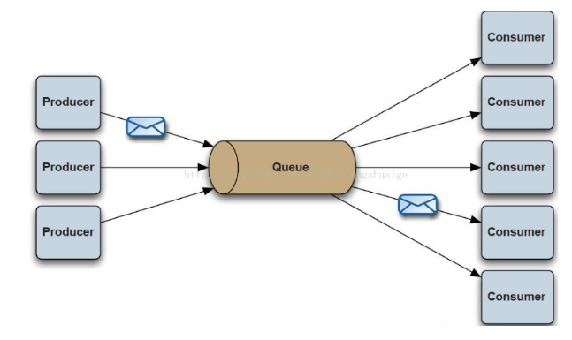
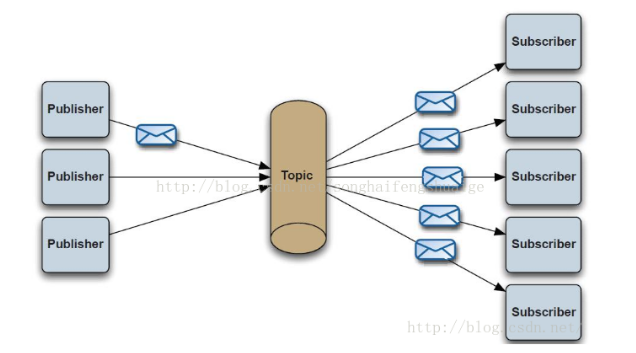
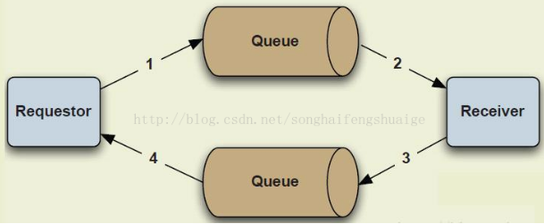

# SpringBoot-ActiveMQ

## 一、概念
### 1、消息机制主要有三种
#### 1.1、点对点(p2p)：包含三个角色：消息队列（Queue），发送者(Sender)，接收者(Receiver)。每个消息都被发送到一个特定的队列，接收者从队列中获取消息。队列保留着消息，直到他们被消费或超时。
P2P的特点
每个消息只有一个消费者（Consumer）(即一旦被消费，消息就不再在消息队列中)
发送者和接收者之间在时间上没有依赖性，也就是说当发送者发送了消息之后，不管接收者有没有正在运行，它不会影响到消息被发送到队列
接收者在成功接收消息之后需向队列应答成功
如果希望发送的每个消息都会被成功处理的话，那么需要P2P模式。

#### 1.2、订阅/发布：包含三个角色主题（Topic），发布者（Publisher），订阅者（Subscriber） 。多个发布者将消息发送到Topic,系统将这些消息传递给多个订阅者。
Pub/Sub的特点
每个消息可以有多个消费者
发布者和订阅者之间有时间上的依赖性。针对某个主题（Topic）的订阅者，它必须创建一个订阅者之后，才能消费发布者的消息。
为了消费消息，订阅者必须保持运行的状态。
为了缓和这样严格的时间相关性，JMS允许订阅者创建一个可持久化的订阅。这样，即使订阅者没有被激活（运行），它也能接收到发布者的消息。
如果希望发送的消息可以不被做任何处理、或者只被一个消息者处理、或者可以被多个消费者处理的话，那么可以采用Pub/Sub模型。

#### 1.3、应答模式：
和前面两种方式比较起来，request-response的通信方式很常见，但是不是默认提供的一种模式。在前面的两种模式中都是一方负责发送消息而另外一方负责处理。而我们实际中的很多应用相当于一种一应一答的过程，需要双方都能给对方发送消息。于是请求-应答的这种通信方式也很重要。它也应用的很普遍。      请求-应答方式并不是JMS规范系统默认提供的一种通信方式，而是通过在现有通信方式的基础上稍微运用一点技巧实现的。

### 2、JMS消息基本组件
#### 2.1、ConnectionFactory
创建Connection对象的工厂，针对两种不同的jms消息模型，分别有QueueConnectionFactory和TopicConnectionFactory两种。可以通过JNDI来查找ConnectionFactory对象。
#### 2.2、Destination
Destination的意思是消息生产者的消息发送目标或者说消息消费者的消息来源。对于消息生产者来说，它的Destination是某个队列（Queue）或某个主题（Topic）;对于消息消费者来说，它的Destination也是某个队列或主题（即消息来源）。
所以，Destination实际上就是两种类型的对象：Queue、Topic可以通过JNDI来查找Destination。
#### 2.3、Connection
Connection表示在客户端和JMS系统之间建立的链接（对TCP/IP socket的包装）。Connection可以产生一个或多个Session。跟ConnectionFactory一样，Connection也有两种类型：QueueConnection和TopicConnection。
#### 2.4、Session
Session是操作消息的接口。可以通过session创建生产者、消费者、消息等。Session提供了事务的功能。当需要使用session发送/接收多个消息时，可以将这些发送/接收动作放到一个事务中。同样，也分QueueSession和TopicSession。
#### 2.5、消息的生产者
消息生产者由Session创建，并用于将消息发送到Destination。同样，消息生产者分两种类型：QueueSender和TopicPublisher。可以调用消息生产者的方法（send或publish方法）发送消息。
#### 2.6、消息消费者
消息消费者由Session创建，用于接收被发送到Destination的消息。两种类型：QueueReceiver和TopicSubscriber。可分别通过session的createReceiver(Queue)或createSubscriber(Topic)来创建。当然，也可以session的creatDurableSubscriber方法来创建持久化的订阅者。
#### 2.7、MessageListener
消息监听器。如果注册了消息监听器，一旦消息到达，将自动调用监听器的onMessage方法。EJB中的MDB（Message-Driven Bean）就是一种MessageListener。
## 二、测试
### 普通订阅 和 列队模式

#### 可通过浏览器访问 jms/queue?value=test 和 jms/topic?value=test 来出发消息的发送,来观察控制台获取信息的情况

### 持久化的测试

* 第一次启动, 会在浏览器 ActiveMQ 管理界面的 Subscribers 也签多出一个 ClientID 名为 client_id 的订阅者. Active Durable Topic Subscribers 表示当前持久订阅者在线, Offline Durable Topic Subscribers 表示当前 持久订阅者不在线.
* 关闭你的服务, 注释掉 Topic2Receiver 中订阅的方法, 再次启动项目. Offline Durable Topic Subscribers 中会出现你的 clientID, 表示这个订阅者下线了. 你通过 jms/topic?value=test 这个接口发送消息, 会发现普通订阅者 正常的收到消息
* 关闭服务, 打开刚才注释调的代码. 重新启动项目, 会发现上一次你发送的消息, 这个时候才收到